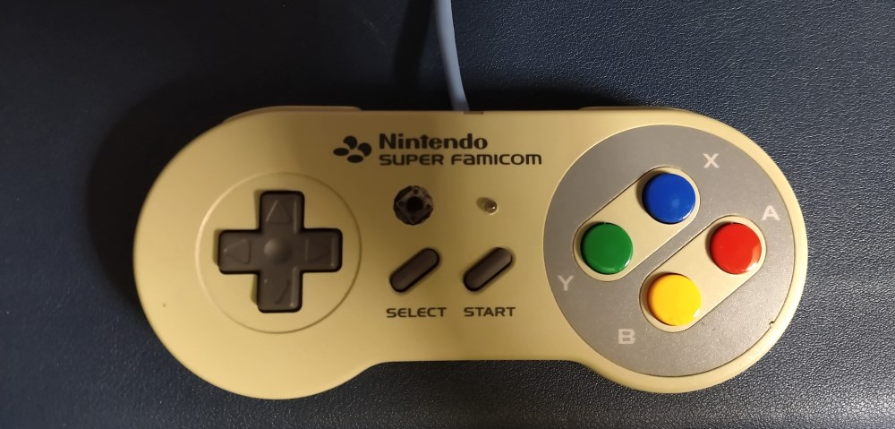

# Pro Trinket SNES Gamepad

Sketch for Adafruit's Pro Trinket that reads in the input from an SNES controller and outputs gamepad over USB.

## Usage
This code is designed for Adafruit's Pro Trinket 5V. Instructions for setting up the Pro Trinket in the Arduino IDE can be found [here](https://learn.adafruit.com/adafruit-arduino-ide-setup/overview).
For the Pro Trinket, set the board to `Adafruit Pro Trinket 16MHz(USB)` and the programmer to `USBtinyISP` in the Arduino IDE. Learn more about about the Pro Trinket [here](https://learn.adafruit.com/introducing-pro-trinket/setting-up-arduino-ide).

## Hardware

### Pin setting

SNES                       | Pro Trinket
---------------------------|-------------
White(Vcc)                 | 5V
Orange(Latch)              | GPIO 3
Red(Clock)                 | GPIO 5
Yellow(Data)               | GPIO 6
LED(on board)              | GPIO 13  
LED(function mode status)  |  GPIO 9
Button(for function mode)  |  GPIO 10

## Software

The Pro Trinket can then be programmed and connected to the computer using a USB cable.

### Using library

[buxit/Pro_Trinket_USB_Gamepad](https://github.com/buxit/Pro_Trinket_USB_Gamepad)

### inspired by...

Thanks to [zfergus/trinket-snes-controller](https://github.com/zfergus/trinket-snes-controller)

## ToDo

- Function mode implementation.

## License

MIT.
